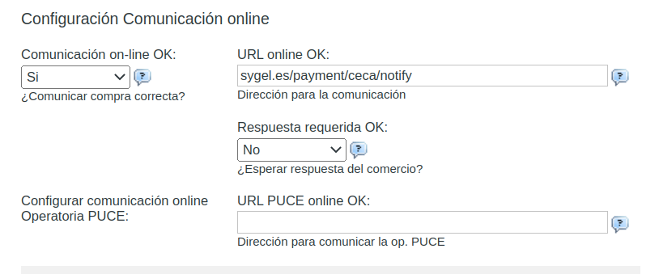

To configure this module, both you and your customer must configure Odoo and the CECA portal platform.

Both platforms must be correctly interconnected and must use the same credentials to ensure proper communication.

## Configure Odoo

To configure this module, you need configure the CECA payment Acquirer. For that, to go to Invoicing > Configuration > Payment Acquirers and select Ceca. The following values need to be set in the Credentials tab:

1. Ceca Acquirer Bin. It can be found in the ceca portal.
2. Ceca Merchant Id. It can be found in the ceca portal.
3. Cerca Terminal Id. It can be found in the ceca portal.
4. Ceca Business Name. It can be found in the ceca portal.
5. Ceca Encriptation Key. It can be found in the ceca portal.
6. Ceca Exponente.
7. Ceca Tipo de Moneda.

It is also possible to force the use of a certain payment mode through the fields 'Force Bizum', 'Force Card', 'Force Google Pay', and 'Force Apple Pay'. Only one checkbox can be selected. In case one of these checkbox is activated, the customer will not be able to select a payment mode, but the one selected will be mandatory. If no payment mode is selected, the customer will be asked to select the payment mode to be used among those activated by the bank.

In order to make Ceca Payment Acquirer available, it needs to be activaded. Go to Invoicing > Configuration > Payment Acquirers and select Ceca, then change the 'State' option to one of the following:

- Disabled. The payment acquirer is not available.

- Enabled. The payment acquirer is available both in test and production environment.

- Test Mode. The payment acquierer is only available for testing.

Keep in mind that different security credentials are used in 'Enable' and 'Test Mode' states. The CECA firm can be badly calculated if you are not using the correct credentials, and then a error will be displayed on the CECA payment screen. To create a testing CECA payment acquirer you can duplicate the original one.

## Configure the CECA portal

You would also need to make some configurations on your CECA portal to ensure the compatibility with this module. Specifically, you must inform CECA of the URL on your server corresponding to the endpoint provided by this module to mark a payment as completed. To do that, you must go to the "Configuración Comunicación Online" of your TPV Portal and fill the following options:

- Comunicación on-line OK: Si
- URL online OK: http://<your_server_domain>/payment/ceca/notify/. Example: https://www.sygel.es/payment/ceca/notify
- Respuesta requerida OK: No

You can see an example in the image located in this module at static/src/img/ceca_config.png to see how to configure CECA on its portal

For more information about how to configure the CECA payment, you can refer to the CECA manual.

